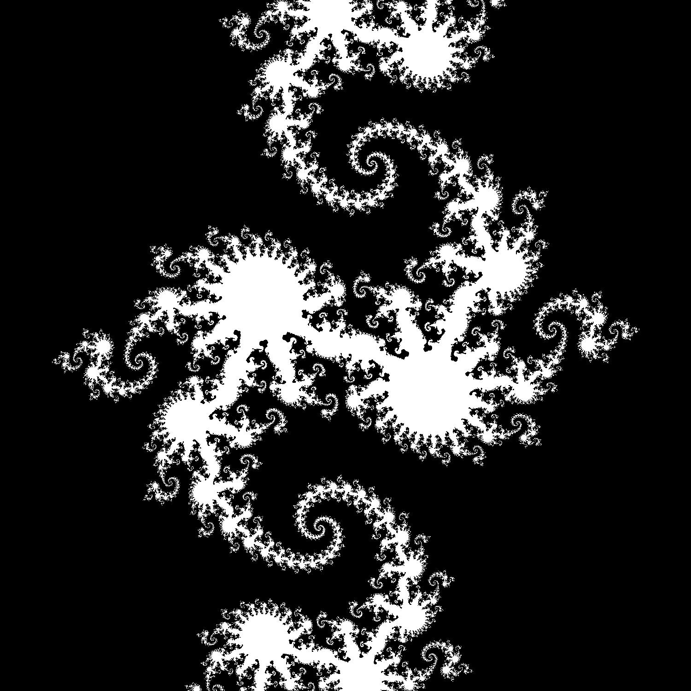
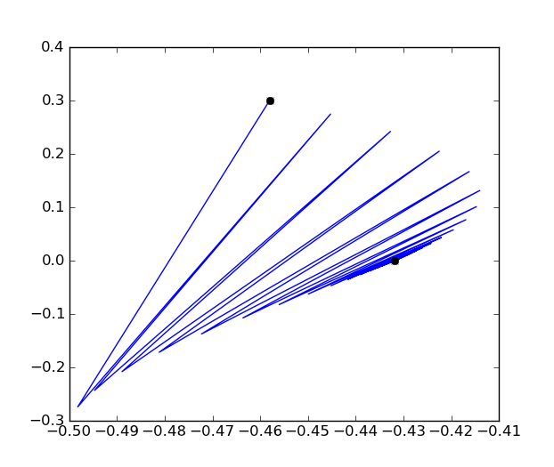

There are no new concepts in this assignment. The difficulty is that you will
be given fewer step-by-step instructions. We encourage you to design your
program in a modular way (i.e. lots of small functions that do distinct
tasks) that is well tested. 

Introduction
------------

The image on the right is one of many 
<a href="http://en.wikipedia.org/wiki/Julia_fractal">Julia Fractals</a>. This image (and many others like it) will be the result of this project.

###Fractals ###

For a variable point (x,y) and a constant point (cx, cy) consider the following equations which take one point (x,y) to another point (x', y'). 

    x' = (x^2 - y^2 + cx)
    y' = 2xy + cy

If you're familiar with complex numbers this is just the map `z' = z^2 + c ` (knowledge of complex numbers is not necessary for this project). 

Starting from a given point (x,y) we can apply this same process again and again. Some points, like (1,1) quickly move away from the origin. For example if we use cx = -.618, cy = 0 we watch how the point (1,1) evolves 

    (1,1) => (-.618, 2)
    (-.618, 2) => (-4.23, -2.47)
    (-4.23, -2.47) => (11.21, 20.94)
    (11.21, 20.94) => (-3.13, 469.7) ...
  
We notice that (-3.13, 469.7) is very far away from (0,0). Once it gets a decent distance away from (0,0) it will continue to move away. Other points, like (.5, .3) stay relatively close to the origin for all time

    (.5, .3) => (-.458, .3)
    (-.458, 3) => (-.498, -.2748)
    (-.498, -.2748) => (-.445, .273)
    ... => (-.494, -.24)
    ... => (-.432, .24)
    ... => (-.488, -.20)
    ... => ... 
    (-.431, 0) => (-.431, 0)

The first point grows rapidly away from the origin. The second point, even though it changes quite a bit in the beginning slowly settles down to a final point of (-.431, 0), a *fixed point* of the iteration. This movement is traced out in the image to the right with a blue line with the second and end points highlighted with a black circle. 

In the fractal image above the point (1, 1) is in the lower right and is 
colored black. All points that evolve out towards infinity are colored black. 
The point (.5, .3) is near the center of the image and is colored white, all
points that stay close to the origin are colored white.

This is what is shown in the fractal image above. The black points evolve out
to infinity, the white points stay close. This image shows the part of the X-Y
plane from -1 to 1 in both x and y. You can see that there is not a simple rule
for which points stay close - it's very complex.

We can't actually wait for a point to evolve out to infinity. In practice we
call a point black if it gets 5 units away within 100 iterations. These numbers
are arbitrary and can be changed.

Making Images
-------------

How do we represent images in memory? In modern color images each pixel is represented by three bytes, one for each of the colors Red, Green and Blue. A byte can hold values from 0 to 255 so a pure Green pixel would have the value (0, 255, 0). In memory we connect these pixels together one after another, starting with the pixel in row 0, column 0, then the pixel in row 0, column 1, etc... until we reach the last pixel. 
Each pixel is arranged in memory as three bytes. First a byte for Red, then a byte for Green, then a byte for Blue

In C we need a data type which takes up only one byte. While we might want to use int to represent these numbers from 0 to 255 this is not a feasible choice. Int's take up too much space (often four bytes). Instead, we'll use char which, on all computers today, takes up only a single byte. We usually use chars to represent characters. As we learned recently though data types merely suggest uses - C will let us break the rules. 

We have done much of the image work for you. Look at the code in `ppm.c` and
`ppm.h`. This includes an image struct and `image_p` type as well as the useful functions

    image_p mk_image(int width, int height)
    void setPixel(image_p img, int row, int col, char red, char green, char blue)
    void saveImage(image_p img, char* filename)
    void free_image(image_p img)

The setPixel function is not finished. You will need to complete it by setting the correct bytes in the linear data array to the values R, G and B. Help strings for all the functions are located in the .h file.

Header Files
------------

You should not copy-paste the ppm.c code into your file. Instead, include it as a library. Include both the files ppm.c and ppm.h in your project directory. At the top of your code you can add the line

    #include "ppm.h"

Note that we're using quotation marks, not angled brackets &lt;, &gt;. This tells the compiler to look for the ppm.h file in your local project directory, not where the normal system libraries live. When you include a .h file you gain access to all the functions and data structures listed in that file.  

Submission
----------

You should submit a single .c file which takes the following arguments:

1. Value for cx (you can convert strings to floats using the function atof)
2. Value for cy
3. Filename in which to save completed fractal

Your program will create an image (sized 500x500 is fine) of the region (-1,1) by (-1,1). It will then display in this image which of the points in this region iterate out to infinity and which stay within a fixed distance of the origin (any reasonable distance is fine). It will then save this image to the filename designated in the arguments. 

I produced the image above by calling my program as follows:

    ./fractal.exe -.8 .156 fractal.ppm

I expect to be able to do the same for yours.

`.ppm` is a little-known file format. This is a very simple image format not in
common use today. Still, because of it's simplicity, many imaging programs will
be able to open it. We've checked that eog (eye of gnome) and gimp on the linux
machines work well. Presumably similar programs in Windows and Mac OS-X should
work as well. Some students have reported odd coloration with certain programs 
in the past.

Challenge 1 - 5%
--------------

For a small amount of additional credit rewrite the image library ppm.c/.h and
your code to include a color structure. `image.data` should be an array of colors, not an array of chars. The word `char` should only appear in your code inside the `struct color` definition 

Reminder: Challenge problems are not necessary to receive a good grade in the class. They are worth relatively few points compared to the amount of effort they take. 

###Submission###

You should just submit the normal files with this additional change. There is
no need to submit the this challenge problem separately.

Challenge 2 5%
--------------

In this assignment we've asked you to produce a black and white image
where black points go out to infinity eventually and white points always stay
close. 

This challenge is to expand your program to produce a more beautiful image. You
could, for example, look at how quickly each point leaves the central region
and somehow convert this speed into a color. There are many other 
possibilities. This system has a lot of complexity to explore 

###Submission###

Include a separate .c file for this challenge and instructions on how to run
it. Your image must be produced by this program. You should also include a
text description of what is represented in the produced image. Remember to
unit-test and document your new code.
