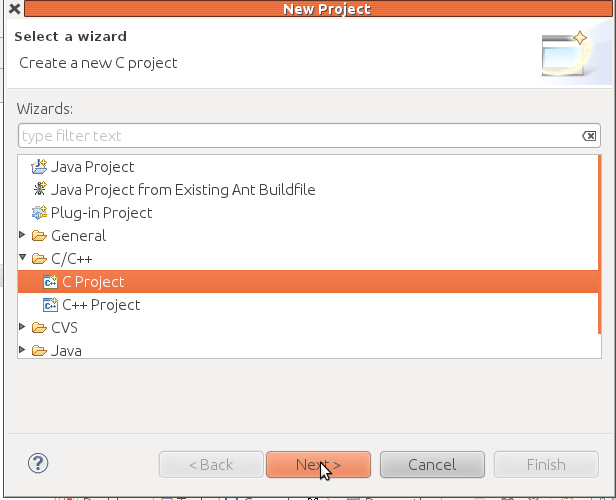
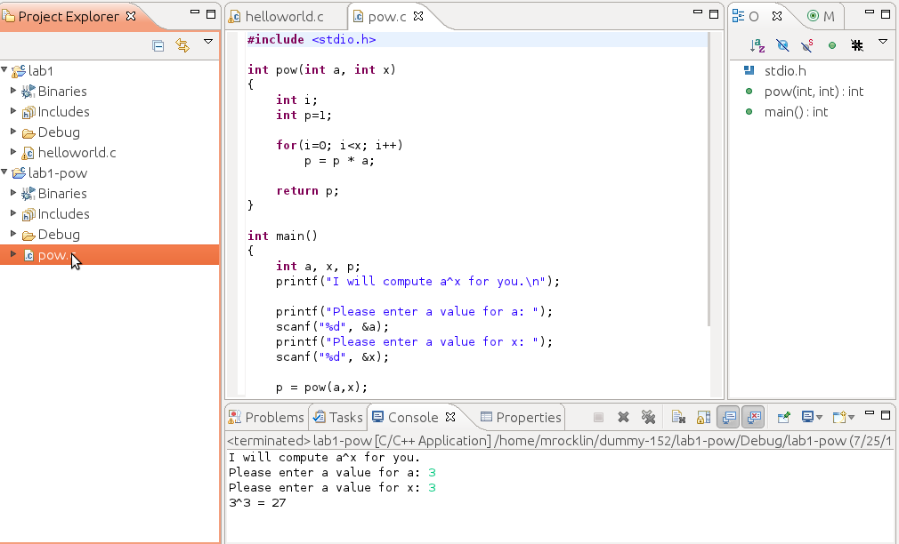
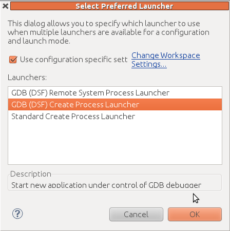

Welcome to lab. Lab is for you to try out new technology or ideas with an instructor present to answer questions immediately if they arise.

SVN
---

We will use SVN to communicate homework between the instructor, students and
graders. After lab you are encouraged to read a [basic document about using
SVN](../../tips/svn.html)

For now, please open up a terminal `Ctrl-Alt-T` and type in the following
commands

    cd
    svn co https://phoenixforge.cs.uchicago.edu/svn/username-152
    cd username-152
    ls

but replace `username` with your CNetID. This downloads a special directory
that will contain all of your homeworks. The `ls` command lists all of the
files in this directory. You should see `lab1-pow` and `hw1` subdirectories.

*Quick Linux Tip*: You can copy and paste in Linux very easily with your mouse.
To copy just select the text by clicking and dragging. To paste middle click
where you want it to go. That's it.

Eclipse
-------

Today we focus on learning how to use Eclipse. Eclipse is an Interactive Development Environment (IDE) that we'll use to develop projects in C. This means that it has all of the tools required to develop and compile C code in one single program. If you like it's like BlueFish combined with gcc. We're using it because it has some other, nicer features that combine these two. 

Eclipse can be opened by selecting **Applications : Programming : Eclipse** in
the upper right of your screen or by opening a terminal (`ctrl-alt-T`) and typing `eclipse`.

The first time you run Eclipse, you will be asked to choose a location for your workspace.  The workspace is where Eclipse will store all your files. By default, the workspace is:
            
    /home/username/workspace
    
Where `username` is your CS account username. Change this to point to your
SVN directory. I.e. change it to 

    /home/username/username-152
    
Unless you want to be asked for your workspace location every time you start Eclipse, make sure you check "Use this as the default and do not ask again".

Next, you will be shown a "Welcome to Eclipse" screen where you will be able to
access tutorials, help documents, ... Choose "Workbench" in the upper right to
enter the Eclipse IDE proper. You should now see something like the following:

The IDE is currently empty, and we need to create a new project to be able to
start coding. To do this, select menu **File : New : Project**. You will be
shown the following screen, where you need to choose **C/C++ : C Project**.

You'll have to choose a name for your project. This can be anything you like
but can not include spaces. `lab1` is a fine name for today's project. Select **Executable : Empty Project** and click Finish

Next you may be shown a screen "Switch to C/C++ Perspective". You can safely
press Yes without changing any settings. Now you will see your first project appear as an icon on the left panel. 

Next we'll add a .c source file which will hold our code. Right click on
`lab1`, select **New : Source File**. Name the file `helloworld.c` and press finish. Your screen should now look like this:

The center panel is an editing window for the file `helloworld.c`.
The bottom panel tells us what errors we have (currently empty) and also
displays our output. 

Lets build a simple hello world C program in Eclipse. Write the following code
into the code editing panel (center) just below the comments. 

    #include <stdio.h>

    void main()
    {
        printf("Hello Eclipse!\n");
    }

Now lets run this program by right clicking on the `lab1` project icon,
selecting **Run As : Run Local C/C++ Application**. The bottom panel is now
showing the Console tab. Console holds the output of the program. You can switch to look at compilation problems any time by clicking on the "Problems" tab.

Great! We can now use Eclipse to create, edit, compile and run files. We could do all these things before with gedit, gcc and the terminal so why Eclipse? Eclipse has two particularly useful features. 

Inline Errors
-------------

First, Eclipse will locate and highlight syntax errors in your program each
time you save. Try this now by intentionally creating at least three bugs in
your program, trying to run, and then seeing which errors occur in the
problems tab. Try producing the following errors. 

 * Remove a semicolon
 * Capitalize `printf` to `Printf`
 * Assign to a variable that has not yet been declared (i.e. write `age=13;` without writing `int age;` above it.
 
You should note the error messages that occur in the bottom panel. These
messages look very strange at first but you will learn to recognize
and understand them. Also note how Eclipse will highlight the bad line of code.
If you hover your mouse over the highlighted line it will give you the
appropriate error message. 
It is a good idea to see which messages are caused by which errors you
create. Building this understanding now will help you find bugs in the future.

Using the Eclipse Debugger
--------------------------

Second, we use Eclipse for its debugger. The Eclipse debugger allows us to step through a program exactly as a computer executes it. This is very useful for finding difficult bugs. 

There is an example in the `lab1-pow` sub-directory in your svn directory.
Import it into Eclipse by making a new C project with the name `lab1-pow`

Double click on the pow.c file within this project and look at the main function in the code. It initializes three integer variables
`a, x, p` and then gets values for these variables from the user
using the `scanf` function. 

`scanf` is like `printf` in reverse. It takes input from the console and
pushes it into a variable. We will use it only rarely in this class.

`main` then computes `a` raised to the power `x` using the function `pow` and
prints the value to the screen. Run this program and test it for yourself. You'll need to enter values for a and x into the console tab when requested. 

Use this program to compute 2 raised to the power 13 and then run it again to
compute 3 raised to the power 4.

At this stage your screen should look something like this:

Now we're going to use the debugger to step through the program and see what it does, line by line. We start by setting a *debug point* at the beginning of the main function. Do this by double clicking on the thin vertical bar just to the left of the code. A small blue "point" should appear as shown below. 

Now, rather than "Run" the program, we'll "Debug" it. Right click on the `lab1_pow` project icon, select **Debug As : Debug Local C/C++ Application**. If it asks you if you'd like to switch to the "debug perspective" the answer is Yes. You will be able to switch back any time by clicking on the "C/C++" button on the upper right of the program or by going to Window : Open Perspective : C/C++ 

You will need to select which debugger you'd like to use. Check the box at the
top and select the middle option

The Debug perspective offers several tabs with lots of interesting information. However, for basic debugging, we will only be interested in two tabs: the one actually containing our program and the "Variables" tab.

Let's start with the code editing panel. Notice how the first executable line is highlighted:

This means that the debugger is ready to process that line. However, it will not do so until we instruct it to. Before doing that, look at the Variables tab:

You will see a list of all the variables declared in the current scope. In
C/C++, uninitialized variables contain no significant value. Your values may be
different than these. Watch this panel as we move forward in the lab - it will
always contain the current values of the active variables.

### Step Over

Now, to run through the program press the F6 key ("Step over"). Notice how each
press of the F6 key makes the debugger run through a single line. If you look
at the console (in the bottom of the screen), you will see the program's output
(you will have to focus on the console whenever a program line includes an
input operation). Keep on running through the program until you reach the end
of the program, observing how the values of the variables change. When you
reach `scanf` lines you will need to enter appropriate values into the console.

### Step Into 

Step over treats each line as a single step, this includes function calls.
Sometimes we want to see what happens within a function. For this we will use
step into. 

Run through the program in debug mode again. This time, when the green bar is
on the line 
	
    p = pow(a,x);

Press the F5 / step into key. This will take you inside the pow function. You
can now press F6 to step through these lines until this function returns. 

Notice how the contents of the "Variables" tab changes. Run through the function line by line and observe how the values of the variables change. This function is an excellent example of a simple for loop.

We encourage you to run this program a few times with different inputs. Each
time you should step into the pow function and watch the for loop work. It is
important to understand exactly how loop structures behave.

Breakpoints 
-----------

Running through the entire program line by line (from beginning to end) can
be slow. Sometimes, we might want to debug a very specific piece of code. In that case, we can specify a breakpoint. When using breakpoints, the debugger runs the program as usual and only pauses (and switches to "line-by-line mode") when it encounters a breakpoint.

For example, we can place a breakpoint when the pow() function is called. To do this, double-click on the left margin of the line where you want to place the breakpoint. A little blue icon will appear:

When you start debugging the program, it will be paused in the first line as before. We can tell the debugger to start running the program until it encounters a breakpoint. Do this either by pressing F8 or click on the "Resume" button in the "Debug" tab. It is a green triangle that looks like a little "Play" button:

The program will ask you for the values of a and x, but you will not have to run through that part of the program line by line. When you reach the call to pow(), the debugger will pause execution. At this point, if you press F6 as before, you will "Step Over" the function call. If you actually wanted to debug the pow() function, you can press the F5 key ("Step Into"), which instructs the debugger to step into the function that is being called.

Make your own project
---------------------

We will now go through all the steps necessary to use Eclipse for your
homework. Your svn directory also contains directories named `hw1-geometry`,
`hw1-weight`, and `hw1-cats`. These are the three problems for
[HW1](../../assignments/hw1/index.html).

Lets get started on the homework by creating an Eclipse project for the first
part of HW1, `hw1-geometry`. Make an Eclipse project whose name matches the 
name of the directory (`hw1-geometry` in this case). Ensure that the
`geometry.c` file is accessible in Eclipse. 

We want to make sure that you know how to submit your work via svn. To test
this we're going to make a very small change to this file and then submit that
small change up to the server. 

Add your name at the top just after the text `Author: `

Open up a terminal (if you don't have one up already) and `cd` to your svn
directory 

    cd               # this resets your location to /home/username
    cd username-152

(change `username` to your username). Now check in your work with an informative message

    svn ci -m"Added name to geometry.c file"

That's it! You should see some text that says transmitting
`hw1-geometry/geometry.c`
Your changes have been submitted and can be seen by the graders and the
instructor.

We encourage you now to start working on your homework while you have teaching
staff present. Alternatively you can go outside and enjoy the sun. 
