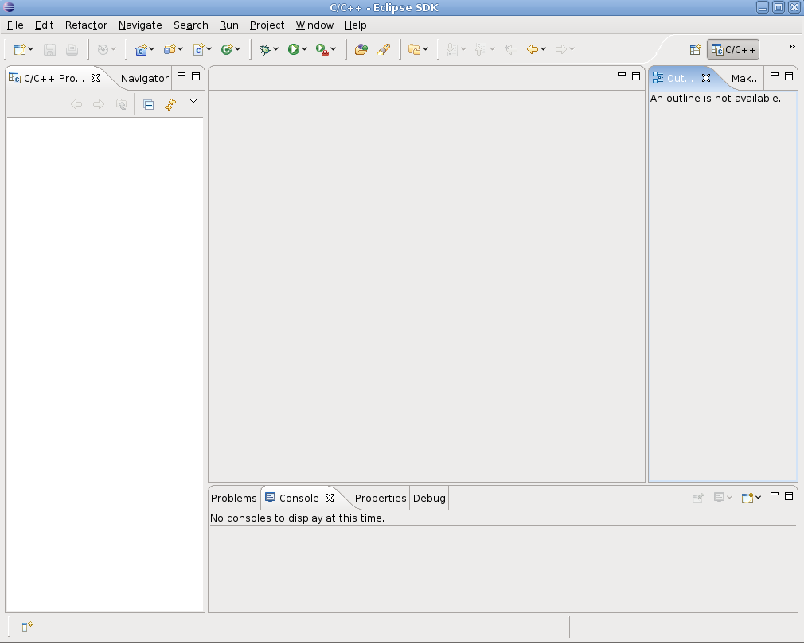
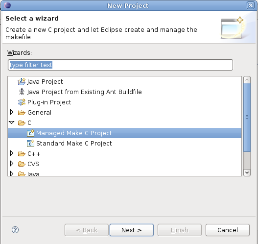
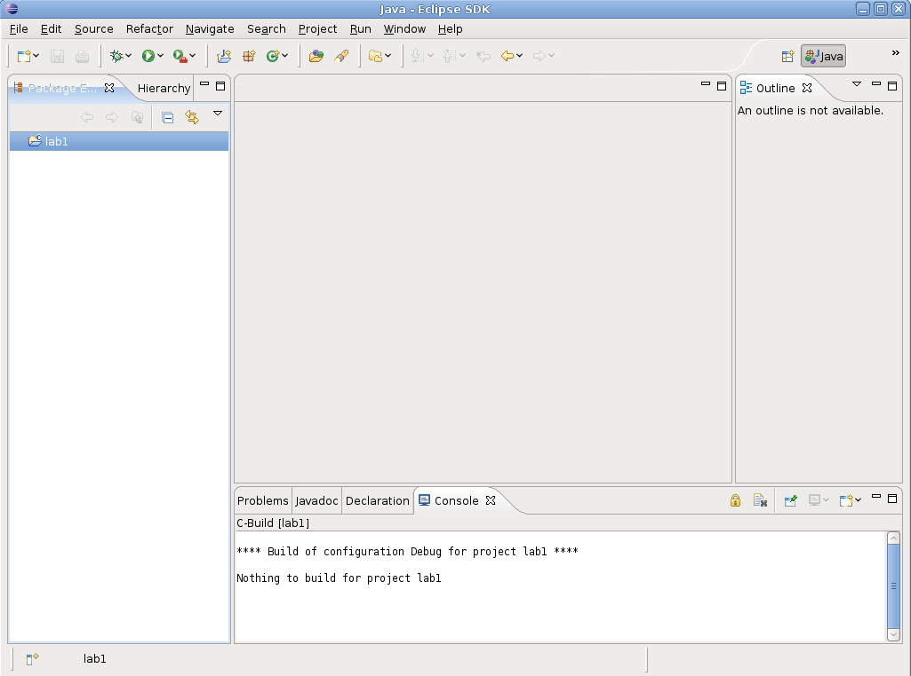
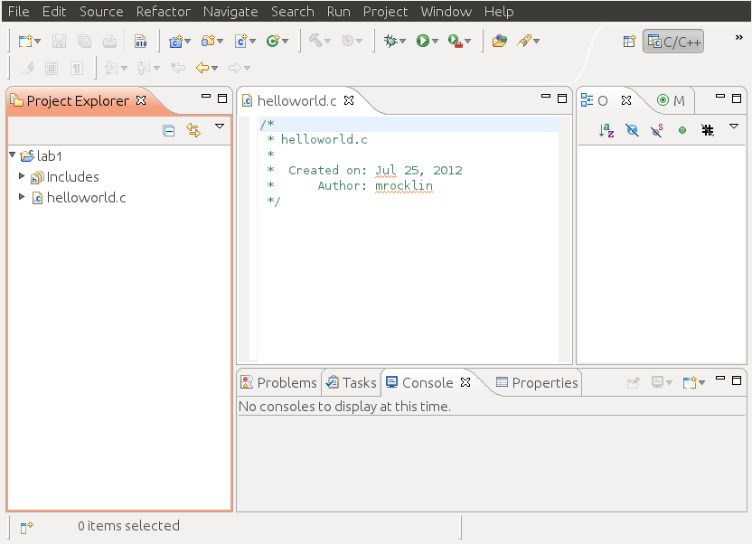
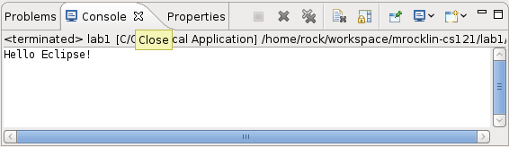
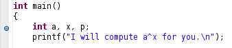
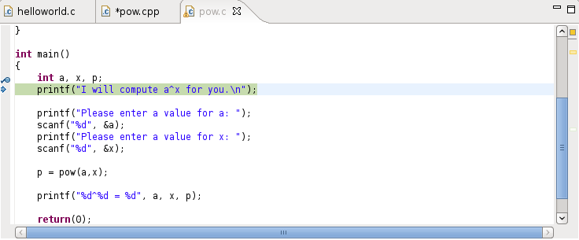
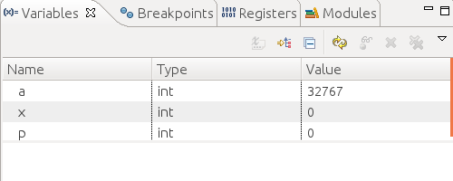
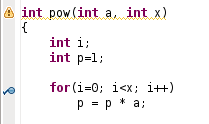

Welcome to lab. Lab is for you to try out new technology or ideas with an instructor present to answer questions immediately if they arise.

Eclipse
-------

Today we focus on learning how to use Eclipse. Eclipse is an Interactive Development Environment (IDE) that we'll use to develop projects in C. This means that it has all of the tools required to develop and compile C code in one single program. If you like it's like BlueFish combined with gcc. We're using it because it has some other, nicer features that combine these two. 

Eclipse can be opened by selecting **Applications : Programming : Eclipse** in
the upper right of your screen or by opening a terminal and typing `eclipse`.

The first time you run Eclipse, you will be asked to choose a location for your workspace.  The workspace is where Eclipse will store all your files. By default, the workspace is:
            
    /home/$USER/workspace
    
Where `$USER` is your CS account username. You can use this default value or choose a different one inside your home directory (the default is a good choice).

Unless you want to be asked for your workspace location every time you start Eclipse, make sure you check "Use this as the default and do not ask again".

Next, you will be shown a "Welcome to Eclipse" screen where you will be able to access tutorials, help documents, ... Choose "Workbench" to enter the Eclipse IDE proper. You should now see the following:

The IDE is currently 'empty', and we need to create a new project to be able to
start coding. To do this, select menu **File : New : Project**. You will be
shown the following screen, where you need to choose **C : Managed Make C
Project**

You'll have to choose a name for your project. This can be anything you like
but can not include spaces. `lab1` is a fine name for today's project. 

Next you will be shown three screens titled "Select a type of project" and "Additional Project Settings" and possibly "Switch to C Perspective". You can safely press Next, Finish, and Yes without changing any settings. Now you will see your first project appear as an icon on the left panel. 

Next we'll add a .c source file which will hold our code. Right click on
`lab1`, select **New : Source File**. Name the file `helloworld.c` and press finish. Your screen should now look like this:

The center panel is an editing window for the file <code>helloworld.c</code>. The bottom panel tells us what errors we have. Currently it's complaining that there isn't any reference to a <code>main()</code> function. Because there is an error a red square has appeared on the <code>lab1</code> project icon, letting us now that this project does not compile. 

Lets make Eclipse happy by building a very simple hello world main program in the source file, <code>helloworld.c</code>

    #include &lt;stdio.h&gt;

    int main()
    {
        printf("Hello Eclipse!\n");
        return 0;
    }

Once we save this file, Eclipse will do a quick recompile and hopefully the error, "undefined reference to 'main'" will disappear. Hopefully no other errors arose. If they did, see if you can fix them using Eclipse's help. 

Now lets run this program by right clicking on the `lab1` project icon,
selecting **Run As : Run Local C/C++ Application**. A screen will come up asking which debugger you'd like to use, leave the default, "GDB Debugger" and press OK. The bottom panel should now have switched from Problems to Console. Console holds the output of the program. You can switch back to look at compilation problems any time by clicking on the "Problems" tab.

Great! We can now use Eclipse to create, edit, compile and run files. We could do all these things before with gedit, gcc and the terminal so why Eclipse? Eclipse has two particularly useful features. 

First, it will do its best to locate and highlight errors in your program each time you save. Try this now by intentionally creating at least three bugs in your program. Try making a variable and then misusing or mistyping it. Save (so that Eclipse recompiles) and see if your bug is highlighted. Remove a semicolon and see if Eclipse finds it. What happens?

Second, we use Eclipse for its debugger. The Eclipse debugger allows us to step through a program exactly as a computer executes it. This is very useful for finding difficult bugs. 

Using the Eclipse Debugger
--------------------------

First, Make a new C project, named lab1_pow and then download this source file
[pow.c](pow.c) which contains code to compute the power of one integer raised to another. To import the <code>pow.c</code> source file into the empty project <code>lab1_pow</code> you can either click and drag it onto the <code>lab1_pow</code> icon or copy (cp) or move (mv) it into the folder <code>/home/username/workspace/lab1_pow/</code>. 
I.e. if you have downloaded pow.c to your home directory you could open a terminal window and type

    mv pow.c workspace/lab1_pow

Look at the main function in the code. It initializes three integer variables <code> a, x, p</code> and then gets values for these variables from the user using the <code>scanf</code> function. It then computes a raised to the power x using the function <code>pow</code> and prints the value to the screen. Run this program and test it for yourself. You'll need to enter values for a and x into the console tab when requested. 

Now we're going to use the debugger to step through the program and see what it does, line by line. We start by setting a <i>debug point</i> at the beginning of the main function. Do this by double clicking on the thin vertical bar just to the left of the code. A small blue "point" should appear as shown below. 

Now, rather than "Run" the program, we'll "Debug" it. Right click on the <code>lab1_pow</code> project icon, select <b> Debug As : Debug Local C/C++ Application</b>. If it asks you if you'd like to switch to the "debug perspective" the answer is Yes. You will be able to switch back any time by clicking on the "C/C++" button on the upper right of the program or by going to Window : Open Perspective : C/C++ 

The Debug perspective offers several tabs with lots of interesting information. However, for basic debugging, we will only be interested in two tabs: the one actually containing our program and the "Variables" tab.

Let's start with the code editing panel. Notice how the first executable line is highlighted:

This means that the debugger is ready to process that line. However, it will not do so until we instruct it to. Before doing that, look at the Variables tab:

You will see a list of all the variables declared in the current scope. As expected in C/C++, uninitialized variables contain no significant value. Your values may be different than these.

Now, to run through the program press the F6 key ("Step over"). Notice how each press of the F6 key makes the debugger run through a single line. If you look at the console (in the bottom of the screen), you will see the program's output (you will have to focus on the console whenever a program line includes an input operation). Keep on running through the program until you reach the end of the program, observing how the values of the variables change.

In this example the variable names are the same in the main function and pow function. This need not be the case. 

Breakpoints 
-----------

Running through the entire program line by line (from beginning to end) can be cumbersome. Sometimes, we might want to debug a very specific piece of code. In that case, we can specify a breakpoint. When using breakpoints, the debugger runs the program as usual and only pauses (and switches to "line-by-line mode") when it encounters a breakpoint.

For example, we can place a breakpoint when the pow() function is called. To do this, double-click on the left margin of the line where you want to place the breakpoint. A little blue icon will appear:

When you start debugging the program, it will be paused in the first line as before. To instruct the debugger to start running the program until it encounters a breakpoint, click on the "Resume" button in the "Debug" tab. It is a green triangle that looks like a little "Play" button:

The program will ask you for the values of a and x, but you will not have to run through that part of the program line by line. When you reach the call to pow(), the debugger will pause execution. At this point, if you press F6 as before, you will "Step Over" the function call. If you actually wanted to debug the pow() function, you can press the F5 key ("Step Into"), which instructs the debugger to step into the function that is being called.

Step into the function and notice how the contents of the "Variables" tab changes. Run through the function line by line and observe how the values of the variables change.

Make your own project
---------------------

Now you will use Eclipse to complete an assignment. You will have to create a new project, create a new source file, write some code, fix errors, and finally run that project. 

Write a program which asks the user to input n numbers (integers) one by one. You may set n to three to start (no need to use scanf for this part). After the user has entered each of the numbers you will print out their maximum. You will need to make a max function and keep track of the current max as the numbers come in. This is very similar to the min function and the sum exercise that we did in class. 

An example execution of your program might look like this.

    Enter number 1: 5
    Enter number 2: 7
    Enter number 3: 2
    The maximum number that you entered was 7
