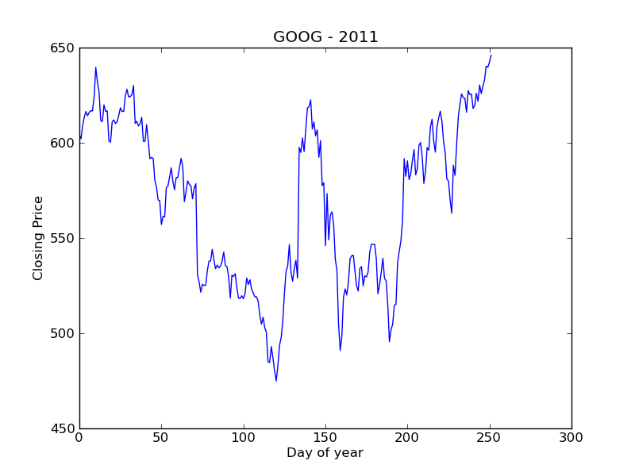

Goals
-----

* Set up a basic Python development environment
* Use IPython
* Manipulate stock data
* Plot

To Start
--------

Update your svn repository to download the materials for lab3. 

    cd username-152
    svn up

There are different versions of Python on the department machines. We will run
a small command to point your computer to the correct one. Make sure you are in
your svn directory and type

    cd lab3
    source update_shell.sh

To verify that you are using the correct python please now type 

    which python

and verify that you see

    /stage/climate/SOFTWARE/epd-7.3-2-rh5-x86_64/bin/python

Hello World
-----------

In lab we will use a text editor and the command line to write and run
programs. We will not use Eclipse. While IDEs like Eclipse do exist for Python
they tend not to be as useful.

Open the file `hello.py` using a text editor. If you don't have a favorite
text editor we suggest `gedit` or `bluefish`. You can access these either by
navigating the Applications menu (Applications:Programming:BlueFish) or by just
typing in `gedit hello.py` or `bluefish hello.py` into the terminal. 

Enter the code 

    print("Hello World")

into the `hello.py` file and press save. Now run this program with the command

    python hello.py

If your terminal isn't responding right now (this is a common problem) it's
because it's busy running gedit or bluefish. You can easily make a new terminal
by pressing `Ctrl-Shift-N` when you're in the terminal window. Now try running
`python hello.py` again. It's ok to have multiple terminal windows open at
once.

Some more Python
----------------

Before we work with a real example lets make sure that we're comfortable
writing functions and loops. Open up a new python file in your text editor, 
`play.py`. Try a few examples from class. In particular try to do the
following. 

* Print out the squares of the numbers 1 to 10 
* Write a function `printSquares` that prints out the squares of the numbers 1 to n, where n is an input to the function. Make sure that this function works. 
* Write a separate function `listSquares` that 
    - creates a list 
    - appends each of the squares from 1 to n onto this list in order
    - returns this list

As a result `printSquares(5)` and `print(listSquares(5))` should both print out the numbers `[1, 4, 9, 16, 25]` (although the formatting will be different between the two). 

IPython
-------

IPython is an interactive console. You can type in Python expressions and have them evaluated for you immediately. This is not a good way to develop large amounts of code but it is a great way to play with the code you have written. 

Open up another terminal (`Ctrl-Shift-N`) and type in 

    ipython --pylab

This should open up a new, more colorful version of your terminal. Type in

    2 + 2

and press enter. You should see `4`. Type in 

    run play.py

To run all of the code you have written in the file `play.py`. In particular the functions that you have defined should now be available in IPython. Try them out.

    printSquares(10)

Stocks
------

With our remaining time we will play with data from Yahoo! finance. Today we will use code written by someone else to interact with Yahoo's online database. 

From IPython run the file ystockquote.py

    run ystockquote.py

Type in `get` and press tab. This will show you all the functions that start with `get`. Press enter a few times or `q` to get out of this list. Type in

    get_price("GOOG")

This gets the current price of the stock with the ticker symbol, "GOOG". This ticker symbol represents the company, Google. If the market were still open you could call this function again and it would give you a new price. Its values are accurate to about 10 seconds. 

Every function in Python has a small documentation string that tells you how it works. See the help string for `get_price` from within IPython by typing

    help(get_price)

Press `q` to quit the help screen after you have finished reading. 

Historical prices
-----------------

The goal of this lab is to produce an image like what is on the right. This image plots the stock price of Google for the year 2011. 

We can get the necessary information to produce this plot from the function `get_historical_prices`. Look at the help string for this function.

Run `get_historical_prices` in IPython to get the historical prices for the year 2011. What is the type of the return value? 

In the following code

    data = get_historical_prices(...)
    L = data[3]
    val = L[4]

What are the types of `data`, `L`, and `val`? If you can not answer this on your own use the function `type` on these variables to see the correct answer.

If we are able to convert this data into a single list of the floats then there is a function `plot` that will plot them for us. We have data in one form and need to convert it to another. This is a very common problem.

Open up a new file `stock.py` and write code to solve this problem. At the top of this program type in

    from ystockquote import *
    
This is the equivalent of `run ystockquote.py` but works within `.py` files (`run` only works in ipython). We suggest that you break up this problem into the following functions.

* Write a small function which takes in a single list (like `L` or `data[i]` in the above example) and returns the closing price as a float. You can use the function `float` to turn a string into a float.
* Write a function which takes in a list of lists (like data above) and returns a list of floats of closing prices. It should use the previous function.
* Write a function which takes in a stock symbol (like "GOOG") and returns a list of closing prices for the year 2009.
* There are two complications
    * Data returned from `get_historical_prices` is in reverse order. You can reverse a list, `L` by typing `L = list(reversed(L))`
    * The first 0th entry in data is different from the rest. You can select all but the first element of a list by using `L[1:]` You might want to try this in IPython first to understand what is going on.
* Make sure that your functions work

Plotting
--------

When we ran IPython we did it with the command

    ipython --pylab

The second entry `--pylab` opened ipython in plotting mode. In particular it imported all of the functionality of the [matplotlib](http://matplotlib.sourceforge.net/) library, the standard plotting library for Python. 

Matplotlib has a number of very useful functions. You might want to take a look at their help stings. In particular today we will use 

    plot    -- plot a list of floats
    title   -- add a title 
    xlabel  -- add a label on the x axis
    ylabel  -- add a label on the y axis
    cla     -- clear the plot

`plot` is particularily useful. If you give it a list of floats it will plot them on the screen. If you give it two lists of floats it will plot them as X-Y coordinates. There are a number of options to select color, line style, etc....

If you have successfully completed the last section you should have such a list of floats. Call plot on it from within IPython. 

Use `title`, `xlabel`, and `ylabel` to add some text to your figure. 

Now that we know how these functions work, make a function `plotTicker` in `stocks.py` that takes a ticker symbol and causes a plot to appear on the screen. To use the plotting functions in `stocks.py` you will need to import them by adding the following line to the top of `stocks.py`

    from pylab import *

If you want to keep going 

* Make a function which plots a symbol for a specific year. 
* Make a function which plots a list of symbols. Search for help on the `legend` function to produce a legend for your plot, it takes a tuple of strings
* Unit-test your code
