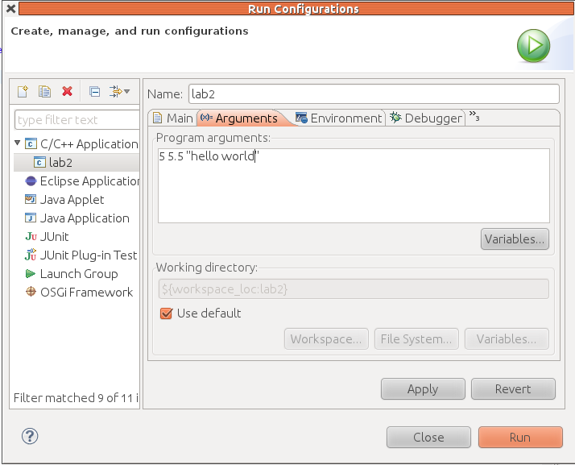

Usually we write main like this

    void main()

You'll often see it written like this instead

    int main(int argc, char* argv[])

This allows us to give our program inputs/arguments. The second input, argv stores the name of the program and the values of the arguments while the first input tells us how many we received. 

We give a program inputs on the command line by following the `./programName` with the inputs. If we wanted to give the program three inputs, 5, 5.5 and the string "hello world" we could type:

    ./programName 5 5.5 "hello world" 

In this case `argc==4` because there is one program and three arguments. 
`argv` is an array of strings (`char* s`) with the following values

* `argv[0] == programName`
* `argv[1] == "5"`
* `argv[2] == "5.5"`
* `argv[3] == "hello world"`

Note that the numeric inputs are stored as strings, not ints or floats. We can
convert strings to numbers using the two functions

    int   atoi(char *s) // convert string to int
    float atof(char *s) // convert string to float

###Eclipse###

To enter arguments in Eclipse 

* Right click on your project icon (in the left panel)
* Run As : Run Configurations...
* Click on the Arguments Tab
* Enter in just the arguments/inputs, not the program name
