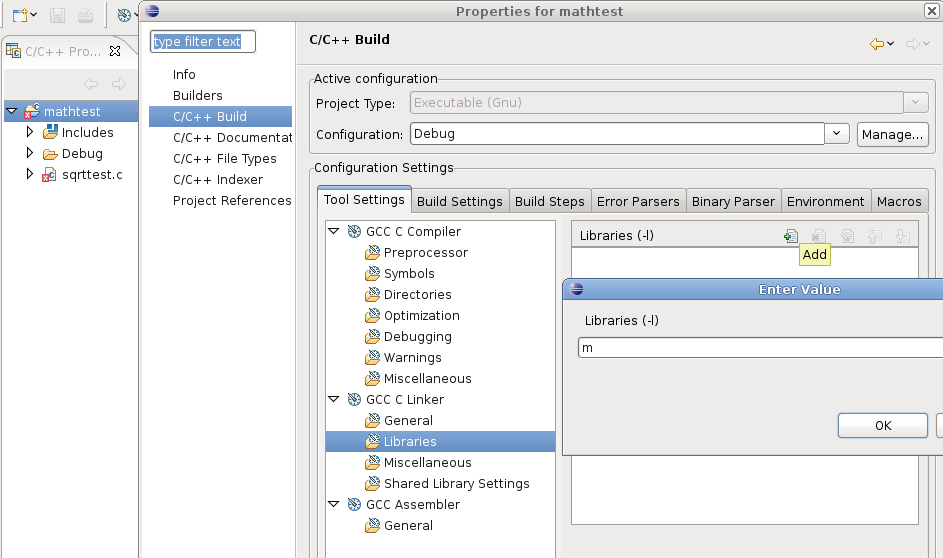

`math.h` is a library of functions that are useful for common mathematical
operations, like square root (`sqrt`), which are not included in the standard C language. To use this library you must do two things.

 * Include the library in your c code by adding this line to the top of your file.

    `#include <math.h>`

 * Compile with the -lm flag 

    `gcc myfile.c -o myfile.exe -lm`

There are many useful functions in math.h. Check them out at [this page](http://www.cs.cf.ac.uk/Dave/C/node17.html)

Additionally `math.h` is only one of many libraries in the *C Standard
Library*. Check out the [wikipedia page](http://en.wikipedia.org/wiki/C_standard_library) if you are interested. There is a nice column of links on the right to the various libraries. Most of these libraries are not useful at our beginning level of programming (don't worry if they're confusing) but it's nice to know that they exist.  

Eclipse
-------

You can add library flags in Eclipse by right clicking on the project icon on the left side of the screen and then going to Properties : C/C++ Build (on the left) : GCC C Linker : Libraries : Click little green icon left of "Libraries (-l)" : Type in 'm' and press OK : Press OK on main window

` Undefined reference to sqrt` error even though the code seems fine. 

Right click on the project icon (mathtest in this example) and go here to fix it. 

