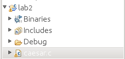

Follow these steps to start up a new C project in Eclipse

1. File : New : Project : C/C++ : C Project
2. Type in the name of the directory in which you want your project stored. If
you are using code that is provided through svn please make sure that the name
matches. I.e. If you're working on lab2 and there is a directory named `lab2`
then be sure to type in `lab2` exactly. A warning should pop up saying 
*"Directory with specified name already exists."*
this is a good sign.
3. *Don't start writing code yet*. Instead, make sure that your project compiles
by clicking on the hammer icon . On the left you
should see that a new subdirectory "Binaries" is created.  

4. Run your program by pressing the play button 
5. Now you may edit and run your program by editing in the text window, saving,
and pressing the green play button  to compile and run.
You should not need to press the hammer button.
